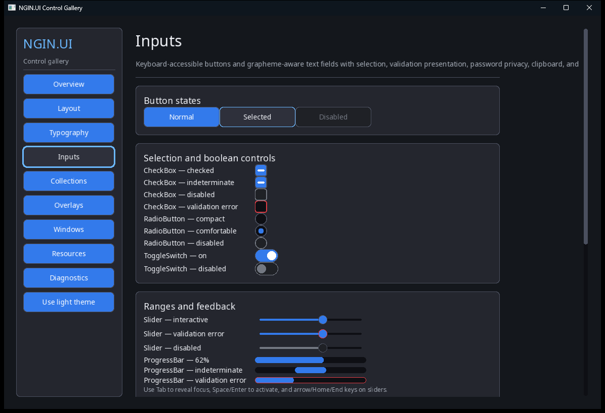

# NGIN.UI Gallery

This app lets you try the controls and features in `NGIN.UI`.



The sidebar has eleven pages:

- **Overview** shows colors, buttons, and custom controls.
- **Layout** shows rows, columns, layers, flexible sizing, and scrolling.
- **Typography** shows font sizes, Unicode text, wrapping, and alignment.
- **Text Area** lets you write, select, copy, paste, and scroll through text.
- **Images** shows fitting, cropping, alignment, clipping, and tint.
- **Inputs** shows buttons, checkboxes, radio buttons, switches, sliders,
  progress bars, tooltips, and text fields.
- **Collections** shows lists, sorting, filtering, combo boxes, tabs, and menus.
- **Overlays** shows a popup that closes with Escape or an outside click.
- **Windows** opens another window and a dialog.
- **Themes** switches between light and dark colors.
- **Diagnostics** shows drawing numbers and optional layout guides.

The [hosted gallery](../NGIN.UI.Gallery.Hosted/) shows the same screens inside
an `NGIN.Core` application.

Build and launch it through the V4 product manifest:

```sh
ngin build --project Examples/NGIN.UI.Gallery/NGIN.UI.Gallery.nginproj \
  --profile Debug --output build/manual/NGIN.UI.Gallery
```

Run the staged executable without arguments to use the gallery interactively:

```powershell
build/manual/NGIN.UI.Gallery/bin/NGIN.UI.Gallery.exe
```

Open a specific catalogue page directly:

```powershell
build/manual/NGIN.UI.Gallery/bin/NGIN.UI.Gallery.exe --page Collections
```

Pass `--smoke` to visit and render every catalogue page, then exit
automatically. Without that flag, the gallery uses the event-driven application
loop until its window is closed.

The deterministic headless companion product is
[`../NGIN.UI.Gallery.Tests`](../NGIN.UI.Gallery.Tests/). It renders every page
through the recording backend and also checks theme, popup, inspector,
auxiliary-window, and modal-dialog state.
