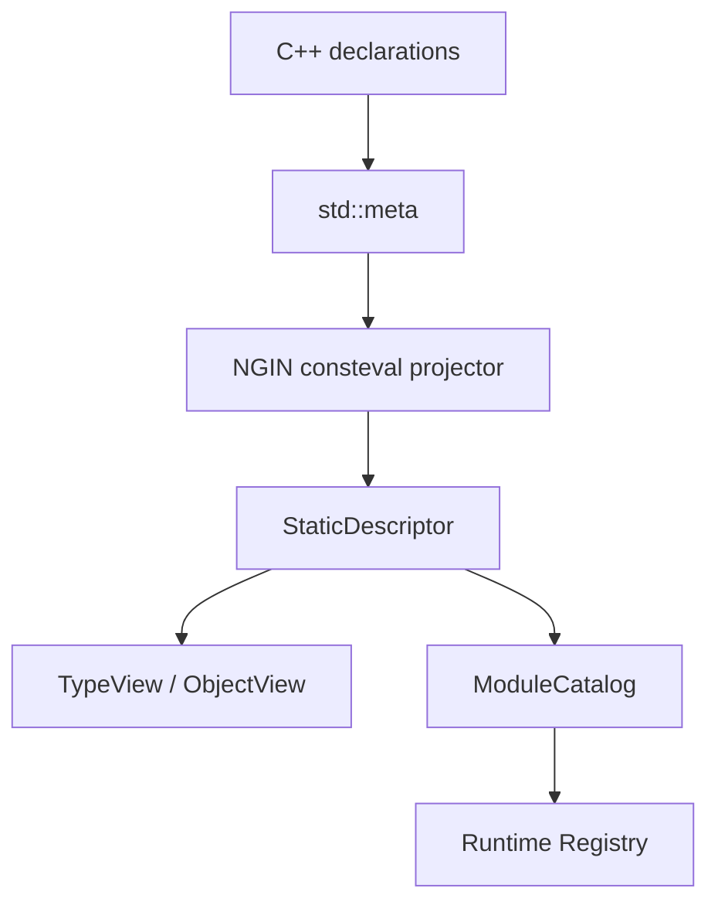
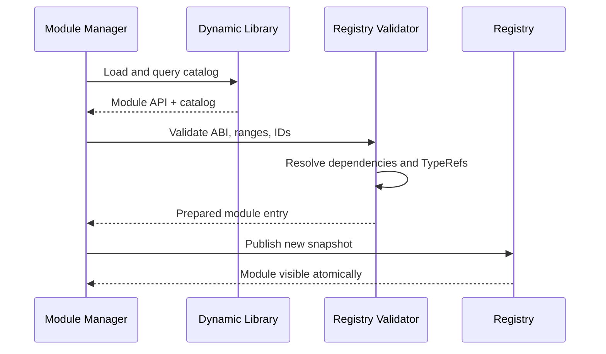
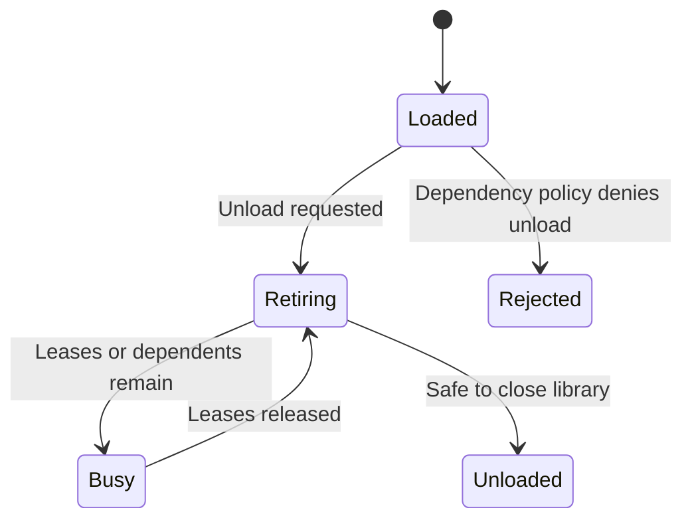

# NGIN.Reflection: Post-C++26 Future Architecture

> **Status:** Deferred future plan
> **Precondition:** Production-ready C++26 reflection and annotations across every compiler supported by NGIN
> **Current direction:** Continue implementing the Clang-free MetaGen scanner plan
> **Future direction:** Make NGIN.Reflection the runtime projection of standard C++ reflection—not a competing reflection language

## 1. Executive decision

The current Clang-free MetaGen plan remains the implementation target.

When standard reflection and annotations are mature across MSVC, GCC, Clang, and AppleClang, NGIN should replace the scanner frontend with a compile-time projector built on `std::meta`. It should preserve the descriptor, registry, invocation, and runtime-module concepts developed by the current plan.

The final relationship should be:

- **Standard C++ reflection** discovers program structure at compile time.
- **Standard C++ annotations** express typed metadata in source.
- **NGIN.Reflection** materializes selected information into immutable runtime descriptors.
- **NGIN runtime modules** export catalogs containing discoverable descriptors and type-erased call thunks.
- **The host registry** combines catalogs and provides dynamic lookup, invocation, plugin discovery, and safe unloading.

NGIN must not create its own alternative to `std::meta::info`, `members_of`, `bases_of`, `annotations_of`, or splicing. It should provide only the runtime services the standard does not attempt to provide.



## 2. Relationship to the current plan

This future plan does not replace or postpone the Clang-free scanner.

The current plan should establish the runtime-facing abstractions that the C++26 implementation will later reuse:

| Current implementation | Future implementation |
| --- | --- |
| Annotation macros | Standard typed annotations |
| Restricted source scanner | `std::meta` queries |
| `ReflectionModel` | Compile-time reflection sequence/projector input |
| Generated C++ descriptor | `consteval`-produced static descriptor |
| Generated module aggregate | Build-generated standard-reflection root |
| `TypeBuilder<T>` calls | Direct descriptor/table construction |
| Runtime registry | Runtime registry, evolved for modules and hot reload |
| C ABI call tables | Versioned C ABI call tables |

The descriptor semantics should remain stable even when the producer changes. Runtime consumers must not know whether metadata came from today’s scanner, a handwritten customization, or future standard reflection.

## 3. Product identity

NGIN.Reflection should describe itself as:

> **A compile-time-generated runtime type system for C++.**

It is not a replacement for C++ reflection.

The standard answers questions such as:

- What members does this type contain?
- What are their types and qualifiers?
- Which annotations apply?
- Which declaration does this reflection represent?
- How can this reflected entity be spliced into generated code?

NGIN answers different questions:

- How can this metadata be retained and queried at runtime?
- How can an unknown object be inspected or invoked safely?
- How are reflected types discovered by name or stable ID?
- How are descriptors shared across executables and dynamic libraries?
- How does a plugin publish reflected types?
- How can a module be unloaded or hot-reloaded safely?
- How are runtime schemas versioned and validated?

## 4. Design principles

1. **The standard is the compile-time source of truth.** Do not wrap or duplicate the standard reflection query API.
2. **Runtime reflection is a projection, not a second description.** Facts are computed at compile time and stored in immutable descriptors.
3. **Typed use is registration-free.** If code already knows `T`, `TypeOf<T>()` works without a global registry.
4. **Global registration is optional.** Only types intended for dynamic discovery enter a module catalog.
5. **Catalogs are module-owned declarations, registries are host-owned indexes.** The distinction must be visible in the architecture.
6. **No uncontrolled static registration.** Module catalogs are imported through explicit build- or loader-controlled entry points.
7. **The C ABI is the module boundary.** Standard-library objects, C++ exceptions, compiler RTTI, and compiler-owned reflection values never cross it.
8. **Type identity is independent of compiler spelling.** Compiler pretty names and `typeid(T).name()` are not durable identities.
9. **Loading and unloading are transactional.** A module becomes visible only after its complete catalog validates and links.
10. **Failures are explicit.** Incompatible schemas, unresolved dependencies, active instances, and stale keys produce structured errors.

## 5. Target developer experience

### 5.1 Typed reflection requires no annotation

Any suitable complete type can be projected on demand:

```cpp
struct Player
{
    std::string name;
    int score;
};

NGIN::Reflection::TypeView type =
    NGIN::Reflection::TypeOf<Player>();
```

This does not add `Player` to a global registry. It instantiates or references the compile-time-generated descriptor for `Player`.

Consumers that already know `T` use this path naturally:

```cpp
Serialize(player);
world.AddComponent<Player>();
container.Resolve<GameService>();
auto object = NGIN::Reflection::View(player);
```

Each subsystem obtains `TypeOf<T>()` internally. The application developer does not register the type separately.

### 5.2 Annotations customize policy

Standard annotations supply typed metadata:

```cpp
struct Player
{
    [[=ngin::serialization::name("display_name")]]
    [[=ngin::editor::category("Identity")]]
    std::string displayName;

    [[=ngin::serialization::ignore]]
    int transientCache{};
};
```

Metadata should normally belong to the consuming subsystem:

- `ngin::serialization::*`
- `ngin::di::*`
- `ngin::editor::*`
- `ngin::rpc::*`
- `ngin::ecs::*`

NGIN.Reflection discovers the annotations and makes supported projections available. It should not centralize every subsystem’s policy in one generic attribute language.

### 5.3 Dynamic discovery is explicit in meaning, not registration

A type intended for editor/plugin/name-based lookup is marked discoverable:

```cpp
struct [[=ngin::discoverable]] Player
{
    std::string name;
    int score;
};
```

`discoverable` means:

> Include this type in its runtime module’s exported catalog.

It does not mean that the type is uniquely “reflectable.” All suitable types are reflectable when known statically.

The build system finds discoverable declarations through standard reflection roots and emits the catalog. The user does not write a type list or registration function.

### 5.4 Private members remain intentional

Public structure can be projected automatically. Access to private or protected members should require deliberate permission:

```cpp
class Account
{
    NGIN_REFLECTION_ACCESS()

    [[=ngin::serialization::name("balance")]]
    double balance_{};
};
```

In the future implementation, `NGIN_REFLECTION_ACCESS()` should grant the projector an appropriate friend/access context. It should not contain registration logic or metadata.

## 6. The three-layer reflection model

### Layer 1: `StaticDescriptor<T>`

The compile-time result of projecting `^^T`:

```cpp
template<class T>
inline constexpr auto StaticDescriptor =
    Detail::ProjectType<^^T>();
```

It contains immutable metadata and pointers to compiler-generated thunks. It should be usable without a registry.

### Layer 2: `ModuleCatalog`

A catalog is the set of discoverable descriptors exported by one runtime module. It also contains:

- free functions exported for reflection;
- references to types owned by other modules;
- module dependencies and compatibility requirements;
- call tables;
- schema and ABI version information; and
- optional migration hooks.

### Layer 3: `Registry`

The registry is the application’s current combined view of loaded catalogs. It supports:

- lookup by `TypeKey` or canonical runtime name;
- enumeration by annotation or capability;
- dependency resolution;
- dynamic invocation;
- module visibility and lifecycle;
- conflict detection; and
- atomic publication of module changes.

This separation prevents ordinary typed reflection from being coupled to global runtime state.

## 7. Compile-time descriptor projection

The projector uses standard reflection facilities to enumerate members, bases, enumerators, functions, parameters, and annotations.

Conceptually:

```cpp
template<std::meta::info Type>
consteval auto ProjectType()
{
    DescriptorBuilder result;

    template for (constexpr auto member :
                  std::meta::members_of(Type))
    {
        ProjectMember(result, member);
    }

    return result.Finish();
}
```

The actual implementation should:

- use standard member and base queries;
- apply the NGIN default inclusion policy;
- inspect typed annotations;
- produce stable runtime names and identities;
- use addressed splicing to generate exact field/method operations;
- generate constructor factory thunks from reflected parameter types;
- validate runtime-projectable signatures during compilation; and
- produce immutable arrays suitable for static storage.

The descriptor should normally reside in read-only program data. Registration should not rebuild it with dynamic vectors during startup.

## 8. Annotation projection policy

Standard annotations may contain arbitrary structural compile-time values. The runtime ABI cannot and should not attempt to preserve every possible annotation object automatically.

Divide annotations into three categories:

| Category | Behavior |
| --- | --- |
| Compile-time-only | Influences generation but is absent from runtime metadata |
| Runtime-projectable | Converted into a stable ABI metadata value |
| Subsystem-consumed | Interpreted by its owning package during descriptor generation |

Provide an explicit customization point:

```cpp
template<class Annotation>
struct RuntimeAnnotationProjector;
```

An annotation enters the generic runtime attribute table only if it satisfies a `RuntimeProjectableAnnotation` contract. This prevents compiler-specific object layout or arbitrary user-defined objects from leaking into the runtime ABI.

The stable runtime value set may include:

- booleans;
- signed and unsigned integers;
- floating-point numbers;
- UTF-8 strings;
- symbols;
- `TypeKey` values;
- arrays of supported values; and
- small named records if later required.

## 9. Build-generated reflection roots

C++ reflection does not automatically run once for every annotated type in the linked program. NGIN still needs a compile-time entry point for global discovery.

The NGIN build system should generate one reflection-root translation unit per runtime module. It imports/includes the module’s public reflection surface and invokes standard reflection on configured roots.

Illustrative project configuration:

```xml
<Reflection Backend="Standard">
  <Root Namespace="Game" />
  <Export Policy="Annotated" />
</Reflection>
```

Generated source conceptually becomes:

```cpp
import Game;

extern "C" const NGINReflectionModuleApiV2*
NGINReflectionQueryModuleV2()
{
    static constexpr auto catalog =
        NGIN::Reflection::BuildModuleCatalog<^^Game>();

    return catalog.Abi();
}
```

For header-based projects, the generated unit includes the configured umbrella headers before reflecting the namespace roots.

This is the only code-generation role that should remain mandatory in the mature C++26 path. It generates a reflection entry point; it does not parse C++ or generate per-type descriptors from text.

## 10. Runtime modules

### 10.1 Terminology

| Term | Meaning |
| --- | --- |
| Runtime module | One executable, static package contribution, shared library, or plugin that publishes a reflection catalog |
| Module catalog | Immutable description of the discoverable types/functions supplied by that module |
| Loaded module | A particular loaded build of a runtime module, including its operating-system library handle |
| Module instance | A unique load/hot-reload generation of a module |
| Registry snapshot | Immutable host view of the catalogs currently published |
| Module lease | A strong lifetime reference that prevents code/data from being unloaded |

### 10.2 Supported module forms

| Form | Catalog acquisition | Unloadable |
| --- | --- | ---: |
| Main executable | Direct generated entry point | No |
| Statically linked package | Build-generated application catalog list | No |
| Shared library | Exported C ABI query function | Usually no, unless managed as a plugin |
| Plugin | Exported C ABI query function through module manager | Yes |
| Hot-reload generation | Loaded alongside the previous plugin generation | Yes, after retirement |

All forms publish the same logical catalog representation. Only acquisition and lifetime differ.

### 10.3 Existing NGIN foundation

The current implementation already contains useful foundations:

- `NGINReflectionModuleApi` as a C ABI boundary;
- `ImportModule` and `UnloadModule`;
- `ModuleIdentity` and `TypeIdentity`;
- runtime call tables for fields, properties, methods, constructors, functions, and casts;
- registry snapshots/generations;
- lifetime tokens for reflected instances; and
- live-instance tracking.

The future design should evolve these mechanisms rather than discard them.

Important changes are still required:

- replace global-generation-only handles with snapshot/module leases;
- track active calls and descriptor views, not only instances;
- make module import and dependency linking explicitly transactional;
- establish compiler-independent logical type identities;
- define hot-reload generations separately from logical module identity; and
- guarantee that function pointers are never invoked after library unload.

## 11. Module catalog ABI

### 11.1 ABI boundary rules

The runtime-module boundary must remain a versioned C ABI.

Never pass these across the boundary:

- `std::string`, `std::vector`, or other standard-library objects;
- C++ exceptions;
- compiler RTTI objects;
- `std::meta::info`;
- owning C++ smart pointers;
- compiler-dependent member pointers; or
- objects that must be destroyed by a different module’s allocator.

Pass only:

- fixed-layout integer records;
- pointer/count spans;
- UTF-8 pointer/length strings;
- stable identities;
- opaque instance handles;
- function pointers with C calling conventions; and
- explicit retain/release or ownership callbacks.

Every exported thunk catches exceptions inside the producing module and converts them into `NGINReflectionStatus`.

### 11.2 Proposed catalog shape

The existing ABI can evolve into a versioned module API conceptually shaped like:

```cpp
struct NGINReflectionModuleApiV2
{
    NGINReflectionAbiHeader header;
    NGINReflectionModuleDescriptor module;
    NGINReflectionCatalogView catalog;
    NGINReflectionCallTables calls;
    NGINReflectionDependencySpan dependencies;
};
```

The query function should return an immutable catalog whose memory remains valid while the library is loaded:

```cpp
extern "C" NGIN_EXPORT
NGINReflectionStatus NGINReflectionQueryModuleV2(
    std::uint32_t requestedAbi,
    NGINReflectionModuleApiV2 const** outApi);
```

The host copies and normalizes metadata during import. Function pointers remain associated with the loaded module and may only be used while holding a module lease.

### 11.3 Host-owned metadata, module-owned executable code

On successful import:

- the host validates all ranges and record counts;
- strings are copied or interned into host-owned storage;
- identities and type references are normalized;
- descriptor records are copied into an immutable registry arena;
- call-table entries remain pointers into the loaded module; and
- the registry’s module entry strongly owns the operating-system library handle.

This prevents module allocators and transient catalog memory from leaking into the host. It also makes it clear that metadata and executable thunks have different ownership.

## 12. Module and type identity

### 12.1 Separate logical identity from loaded implementation

Use separate identities for separate questions:

```text
ModuleKey        Stable logical module/package identity
ModuleVersion    Published semantic or contract version
ModuleInstanceId Unique loaded build/hot-reload generation

TypeKey          Stable logical type identity
SchemaVersion    Author-declared compatibility version
SchemaHash       Generated hash of projected runtime shape
Implementation   ModuleInstanceId + descriptor index
```

### 12.2 Type keys

`TypeKey` must not be based solely on compiler-pretty-function strings, mangled names, or RTTI.

Recommended policy:

- internal/local types may derive a key from the module key and canonical reflected name;
- discoverable or persisted types should be able to declare an explicit stable ID;
- renamed source types can retain their runtime identity through an annotation;
- serialized/RPC schemas should carry `TypeKey` plus schema version, not compiler type names.

Example:

```cpp
struct [[=ngin::discoverable,
         =ngin::type_id("game.player")]] Player
{
    // ...
};
```

The exact string/UUID syntax can be decided later, but the distinction between source name and logical identity must be designed now.

### 12.3 Schema conflicts

When two loaded modules publish the same `TypeKey`:

- identical compatible schemas may be treated as the same contract only under an explicit policy;
- different `SchemaHash` values require a declared compatibility/migration relationship;
- unrelated implementations with the same key are an import conflict;
- an implementation replacement during hot reload uses a new `ModuleInstanceId` even if `TypeKey` remains stable.

## 13. Module loading protocol

Module loading should be an explicit transaction:



Detailed steps:

1. Load the dynamic library without publishing it.
2. Resolve the versioned reflection query symbol.
3. Request the highest mutually supported ABI version.
4. Validate the module identity, catalog bounds, strings, descriptor indices, and call-table slots.
5. Copy and normalize metadata into a host-owned staging arena.
6. Resolve module requirements and `TypeKey` references.
7. Detect identity/schema conflicts.
8. Construct a `LoadedModule` containing the OS handle, normalized metadata, call tables, and counters.
9. Build a new immutable registry snapshot.
10. Publish the snapshot atomically.

If any step fails, discard the staged module and unload the library. No partial type or function registration becomes visible.

## 14. Dependencies between runtime modules

### 14.1 Dependency declarations

Each catalog should declare runtime requirements independently of build/link dependencies:

```text
Required module/capability key
Accepted contract/version range
Required or optional
Native ABI required or type-erased ABI sufficient
```

A type reference crossing module boundaries stores a `TypeKey`, not a pointer to another module’s descriptor.

### 14.2 Two-phase linking

Support cyclic type references through two phases:

1. **Declare:** Insert all staged `TypeKey` identities into a temporary resolution table.
2. **Link:** Resolve bases, fields, parameters, return types, annotations, and function contracts against that table.

This allows module A to refer to a type from module B while B also refers to a type from A, as long as their runtime requirements can be loaded as one transaction.

### 14.3 Required versus optional references

- A required base, invocation parameter, or construction dependency must resolve before publication.
- An optional annotation reference may remain symbolic.
- A descriptive type reference may be exposed as unresolved metadata only if no operation assumes its concrete descriptor.
- Diagnostics must name the importing module, owning type/member, missing `TypeKey`, and required version range.

### 14.4 Unload dependencies

The registry maintains the resolved runtime dependency graph.

Unloading a module is rejected when another published module has a hard dependency on it, unless the module manager retires the dependent closure in the same transaction.

## 15. Lookup, views, and handle validity

The current registry generation model can make every previously issued handle stale after an unrelated module change. The future API should avoid that disruption.

### 15.1 Durable identity

Store `TypeKey` when information must survive registry changes:

```cpp
NGIN::Reflection::TypeKey playerKey =
    NGIN::Reflection::TypeKeyOf<Player>();
```

Resolve it against the current registry when needed.

### 15.2 Snapshot-pinned views

`TypeView`, `FieldView`, `MethodView`, and related objects should hold or reference a shared immutable registry snapshot/module entry.

Consequences:

- loading an unrelated module does not invalidate an existing view;
- the underlying catalog cannot disappear while a view is active;
- invocation can acquire the associated module lease safely; and
- full unload may wait for old views to be released.

The API should clearly distinguish:

- cheap short-lived views;
- durable logical keys; and
- owning instance handles.

Do not encourage applications to store raw descriptor pointers or numeric registry indices.

## 16. Cross-module invocation

An invocation follows this path:

1. Resolve the target method/constructor/function from a pinned descriptor view.
2. Validate argument count and `TypeKey` compatibility in the host.
3. Convert arguments into ABI-safe `NGINReflectionValue` records.
4. Acquire an active-call lease on the producing module.
5. Invoke the module-owned thunk.
6. Catch and translate errors inside the thunk.
7. Return a value carrying explicit ownership and destruction behavior.
8. Release the active-call lease.

The producing module is responsible for:

- casting its opaque instance pointer to the real C++ type;
- invoking the exact reflected member generated through standard reflection;
- constructing and destroying its own objects;
- allocating and freeing any owned return storage; and
- translating exceptions into status values.

The host must never directly invoke compiler-specific member pointers from a foreign module.

## 17. Instance ownership

`NGINReflectionInstanceHandle` should remain an opaque, reference-counted cross-module handle.

Every instance records:

- its stable `TypeKey`;
- its producing `ModuleInstanceId`;
- an opaque object pointer;
- retain/release/get-const/get-mutable callbacks where permitted; and
- a strong lease on the producing loaded module.

An object created by module A is destroyed by module A. The host and other modules never use `delete` on it.

Passing arbitrary native C++ references between independently compiled modules is not portable. Cross-compiler interoperability is guaranteed only through the C ABI value/instance protocol unless a stricter native ABI compatibility contract is explicitly declared.

## 18. Safe module unloading

Unloading should be a retirement process, not immediate removal:



Protocol:

1. Validate that no published hard-dependent module remains.
2. Atomically publish a registry snapshot that no longer offers the module to new lookups.
3. Mark its `LoadedModule` as retiring so new invocations are rejected.
4. Wait for or report remaining descriptor views, active calls, and live instances.
5. Release the exported module API/catalog if required by that ABI version.
6. Destroy the host-owned module entry.
7. Close the operating-system library handle.

Track at least:

- active descriptor/snapshot leases;
- active invocation count;
- live reflected instances;
- dependent modules; and
- externally adopted child/parent instance relationships.

`UnloadModule` should return structured states such as `Succeeded`, `Busy`, `HasDependents`, `NotUnloadable`, and `NotFound`, with diagnostic counts.

## 19. Hot reload

Never replace call-table pointers in place.

Hot reload should load the new binary as a new `ModuleInstanceId`:

1. Load and validate the new module beside the old one.
2. Compare exported `TypeKey`, schema version, and schema hash values.
3. Establish migration eligibility.
4. Atomically publish the new module for future lookup and construction.
5. Mark the old module instance as retiring.
6. Keep existing instances and views attached to the old module until released or migrated.
7. Unload the old binary only after every lease and instance has gone.

Optional state migration can be layered on top:

```cpp
struct MigrationContext
{
    TypeKey type;
    SchemaVersion from;
    SchemaVersion to;
};
```

A migration hook should operate on a stable intermediate representation or explicit ABI values. It must not assume the old and new native C++ layouts are compatible.

## 20. Static modules and application startup

Statically linked packages cannot be discovered with dynamic-symbol lookup. The NGIN build system should generate one application catalog aggregator from the target dependency graph:

```cpp
void ImportApplicationReflection(Registry& registry)
{
    registry.Import(GetCoreCatalog());
    registry.Import(GetEcsCatalog());
    registry.Import(GetGameCatalog());
}
```

This file is generated automatically and called from explicit application startup. It does not use global constructors or linker-section magic.

Static and dynamic catalogs pass through the same validator and conflict-resolution rules so behavior does not diverge by linkage form.

## 21. Cross-compiler and cross-platform guarantees

Standard reflection makes descriptor generation portable at source level. It does not make arbitrary C++ object ABIs identical.

NGIN should promise:

- identical public reflection behavior across supported compilers;
- a versioned C catalog and invocation ABI;
- compiler-independent logical module/type identities;
- compiler-local generated thunks;
- no dependence on compiler RTTI names; and
- no standard-library object ownership across module boundaries.

NGIN should not promise that a class built with one compiler can be passed by value to arbitrary C++ code built with another compiler.

Where platform/toolchain-native ABI compatibility is deliberately supported, a module requirement should state an ABI fingerprint containing the relevant target architecture, calling convention, compiler ABI family, standard-library ABI, build mode, and NGIN ABI family/version.

The default cross-module path remains type-erased and C-ABI-safe.

## 22. Public API direction

### Typed/local access

```cpp
TypeView TypeOf<T>();
ObjectView View(T& object);
ConstObjectView View(const T& object);
TypeKey TypeKeyOf<T>();
```

These APIs use `StaticDescriptor<T>` and do not require catalog registration.

### Dynamic access

```cpp
Expected<TypeView> Registry::GetType(TypeKey key) const;
Expected<TypeView> Registry::GetType(std::string_view canonicalName) const;
Range<TypeView> Registry::Types() const;
Range<TypeView> Registry::TypesWith(AnnotationKey key) const;
```

### Module lifecycle

```cpp
Expected<ModuleHandle> ModuleManager::Load(Path library);
Expected<void> ModuleManager::ImportStatic(const ModuleCatalog& catalog);
UnloadResult ModuleManager::Unload(ModuleKey key);
Expected<ModuleHandle> ModuleManager::Reload(ModuleKey key, Path replacement);
```

The application should normally interact with a module manager. Low-level `ImportModule` and raw ABI structures remain infrastructure APIs.

## 23. Evolution of the existing implementation

| Existing concept | Keep | Evolve |
| --- | ---: | --- |
| `TypeBuilder<T>` | Yes during migration | Make it an emitter/projector target, then optionally replace dynamic build state with static descriptor construction |
| `Describe<T>` / `NginReflect` | Yes | Retain as explicit override/augmentation hooks |
| `ModuleRegistration` | Yes during current plan | Make generated/runtime-module catalogs the primary input |
| `NGINReflectionModuleApi` | Yes | Version it and formalize immutable catalog acquisition |
| `ModuleIdentity` | Yes | Separate logical key/version from loaded instance identity |
| `TypeIdentity` | Yes | Separate `TypeKey`, schema version/hash, and implementation binding |
| Registry snapshots | Yes | Let views pin snapshots/modules instead of invalidating on any global generation change |
| Call tables | Yes | Require module leases and C ABI exception containment |
| `liveInstances` | Yes | Add active calls, views/leases, and dependency tracking |
| Generated static registrar | No long term | Replace with explicit generated catalog import |
| Compiler-derived type names as identity | No | Use canonical logical identities |

## 24. Work to do now that protects the future

The current Clang-free plan should make these choices now:

- keep parser/scanner types out of runtime descriptor and registry APIs;
- define one backend-neutral descriptor semantic model;
- generate explicit module catalogs/aggregates instead of scattered static registrars;
- keep a versioned C ABI for runtime-module import;
- separate canonical reflected names from stable logical IDs;
- make annotation macros capable of mapping to standard typed annotations later;
- make handwritten descriptors produce the same representation as generated descriptors;
- ensure generated call thunks catch exceptions and respect allocator ownership;
- test shared-library import/unload independently from MetaGen; and
- avoid making registry-global numeric indices part of public identity.

These decisions are valuable today even if standard reflection adoption is years away.

## 25. Future delivery phases

### Phase F0 — Freeze the projection contract

- [ ] Specify `StaticDescriptor`, `ModuleCatalog`, `Registry`, and their ownership boundaries.
- [ ] Separate logical `TypeKey` from schema and implementation identity.
- [ ] Version the annotation-to-runtime projection rules.
- [ ] Define which current `TypeBuilder` semantics must remain compatible.

**Exit criterion:** A scanner-generated descriptor and a hypothetical standard-reflection descriptor are semantically interchangeable.

### Phase F1 — Introduce static descriptor consumption

- [ ] Allow `TypeOf<T>()` to use an immutable static descriptor without global registration.
- [ ] Adapt the current generated backend to emit the static representation.
- [ ] Keep the registry as an optional catalog index.
- [ ] Add object views based on static descriptors.

**Exit criterion:** Typed reflection works without module registration even before the C++26 backend arrives.

### Phase F2 — Standard reflection projector

- [ ] Implement member/base/enum projection using `std::meta`.
- [ ] Implement exact field and method thunks through splicing.
- [ ] Implement constructor factory thunks from reflected parameter types.
- [ ] Map standard annotations through explicit annotation projectors.
- [ ] Compare projected descriptors against scanner-generated semantic golden tests.

**Exit criterion:** A single type produces equivalent runtime behavior through scanner and standard-reflection backends.

### Phase F3 — Standard-reflection module catalogs

- [ ] Add reflection roots to NGIN project configuration.
- [ ] Generate a catalog translation unit per runtime module.
- [ ] Enumerate and filter discoverable declarations at compile time.
- [ ] Remove source parsing from capable configurations.
- [ ] Retain the scanner only for legacy compiler targets during transition.

**Exit criterion:** A module publishes all annotated discoverable types without parsing C++ source.

### Phase F4 — Runtime module ABI v2

- [ ] Implement host-owned metadata import.
- [ ] Add logical module/type keys and schema hashes.
- [ ] Add transactional dependency linking.
- [ ] Add snapshot-pinned views and module leases.
- [ ] Track active calls, instances, views, and dependencies.
- [ ] Add structured unload diagnostics.

**Exit criterion:** Static and dynamic module catalogs behave identically through the host registry and unload safely.

### Phase F5 — Hot reload and schema migration

- [ ] Load module generations side by side.
- [ ] Publish new registry snapshots atomically.
- [ ] Retire old module generations safely.
- [ ] Define compatibility and migration hooks.
- [ ] Add editor-oriented reload diagnostics and tooling.

**Exit criterion:** A plugin can be rebuilt and reloaded without invalidating unrelated modules or invoking unloaded code.

### Phase F6 — Retire compatibility syntax

- [ ] Make standard annotations the documented syntax.
- [ ] Keep macros as aliases for a defined compatibility window.
- [ ] Deprecate scanner-only selector metadata that standard reflection no longer needs.
- [ ] Remove MetaGen source parsing when all supported compilers pass the standard-reflection conformance suite.

**Exit criterion:** Standard C++ reflection is the only production metadata frontend, while runtime APIs remain compatible.

## 26. Test plan

### Compile-time projection

- standard-layout and polymorphic types;
- public/private/protected members and bases;
- overloaded, static, ref-qualified, and `noexcept` methods;
- constructors, defaults, and DI parameter annotations;
- enums and underlying types;
- nested and concrete template specializations;
- annotations from multiple subsystems;
- annotation projection rejection for unsupported runtime values; and
- parity against the current scanner descriptor model.

### Runtime modules

- static catalog aggregation;
- shared-library import through every supported compiler/platform combination;
- malformed catalog bounds and slot validation;
- ABI family/version negotiation;
- duplicate module and type keys;
- compatible and incompatible schema hashes;
- missing hard and soft dependencies;
- cyclic module type references;
- lookup during concurrent module publication;
- invocation while another module loads;
- unload with live views, calls, instances, and dependents;
- exception containment inside thunks;
- allocator ownership across returns;
- plugin reload with old instances still alive;
- migration success/failure rollback; and
- no use-after-unload under sanitizers and stress tests.

### Cross-compiler boundaries

- host and plugin built with different supported compiler families where the platform C ABI permits;
- no compiler RTTI or mangled-name dependency;
- canonical `TypeKey` equality across compilers;
- correct UTF-8 names and source-independent IDs;
- opaque instance retain/release across module boundaries; and
- rejection of unsupported native-ABI contracts.

## 27. Acceptance criteria

The future architecture is complete when:

- `TypeOf<T>()` works without registration for ordinary typed use.
- Standard reflection and typed annotations are the only source-analysis mechanism.
- NGIN does not duplicate the `std::meta` query API.
- Runtime descriptors are immutable and produced at compile time.
- Discoverable types enter catalogs without handwritten type lists.
- Static libraries, shared libraries, and plugins publish the same catalog semantics.
- Module import is validated and atomically published.
- Unrelated module changes do not invalidate existing descriptor views.
- Every invocation and live instance pins the producing module.
- A module cannot be unloaded while its code, objects, views, or dependents remain active.
- Hot reload keeps old and new module generations separate.
- Logical type identity is stable across supported compilers and source renames when explicitly configured.
- Arbitrary C++ objects and allocators never cross the module boundary unsafely.
- Runtime consumers cannot tell whether the descriptor was originally scanner-generated or standard-reflection-generated.

## 28. Deferred decisions

Resolve these when compiler implementations are mature enough to prototype against:

- the final standard feature-test gates and minimum compiler revisions;
- the exact access-context mechanism for private reflection;
- whether namespace roots, C++ module roots, or both are the preferred catalog entry point;
- whether discoverable types default to explicit opt-in or public-root inclusion with opt-out;
- the precise 128-bit/UUID/hash representation of `ModuleKey` and `TypeKey`;
- schema compatibility rules and whether they belong in NGIN.Reflection or a separate schema package;
- the runtime representation of arrays/records in annotation values;
- whether metadata remains queryable after a module is retired but before its final lease is released; and
- how much native C++ ABI interoperability is permitted in homogeneous toolchain deployments.

## 29. References

- [P2996R13: Reflection for C++26](https://www.open-std.org/jtc1/sc22/wg21/docs/papers/2025/p2996r13.html)
- [P3394R4: Annotations for Reflection](https://www.open-std.org/jtc1/sc22/wg21/docs/papers/2025/p3394r4.html)
- [NGIN repository](https://github.com/NGIN-ORG/NGIN)
- [NGIN.Reflection repository](https://github.com/NGIN-ORG/NGIN.Reflection)
