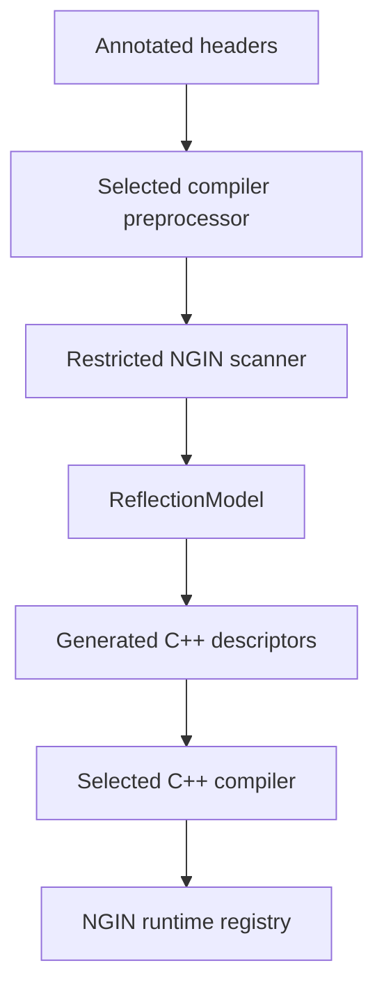

# NGIN.Reflection MetaGen: Clang-Free Reflection Plan

> **Status:** Scanner backend implemented; C++26 backend deferred
> **Baseline:** C++23, MSVC/GCC/Clang/AppleClang
> **Direction:** Annotation-first code generation now; C++26 static reflection when toolchains converge
> **Primary outcome:** Unreal-like ease of use without a Clang library dependency, a required base class, or manual registration

## 1. Executive decision

Replace the current libclang-based `MetaGen` frontend with an **NGIN Header Tool**: a small, deliberately restricted source scanner that reads only annotated declarations and produces ordinary C++ registration code.

The scanner will:

1. ask the project's selected compiler to preprocess a generated scan translation unit;
2. parse the resulting C++ with a lightweight syntax parser;
3. convert marked declarations into a compiler-neutral `ReflectionModel`;
4. generate `TypeBuilder<T>` calls and all module registration automatically; and
5. let the actual C++ compiler perform final semantic validation.

This provides Unreal-style ergonomics today while staying compiler- and platform-neutral. A later C++26 backend can consume standard reflection and annotations to build the same runtime metadata without changing user code or the runtime registry.



## 2. Why this architecture

### Attributes alone are not enough in portable C++23

Current standard attributes can mark a declaration, but a portable C++23 program cannot enumerate those declarations, recover their complete semantics, or turn them into member pointers. Unknown attributes may also be ignored by a compiler. Some form of source analysis or compiler reflection is still required.

### C++26 reflection is applicable, but not yet a portable baseline

Static reflection can generate runtime metadata: compile-time reflections can be inspected and used to instantiate `TypeBuilder<T>` calls. It is therefore a viable future implementation, despite being *static* reflection.

It cannot be the only implementation yet. Compiler support remains uneven, and constructor reflection/addressing has additional limitations. NGIN should treat C++26 reflection as an optional backend rather than making it a prerequisite.

### A restricted scanner is a better fit than a replacement compiler frontend

MetaGen does not need to understand all of C++. It needs to recognize a stable annotation grammar, associate annotations with declarations, capture source spelling, and generate code that the real compiler verifies. This keeps the scanner small and makes failures explicit instead of attempting incomplete semantic analysis.

## 3. Goals and non-goals

### Goals

- No libclang, LLVM, compiler SDK, or compiler AST dependency.
- No handwritten per-type or per-module registration in the normal path.
- One annotation model across MSVC, GCC, Clang, and AppleClang.
- No required base class, object model, garbage collector, or engine lifecycle.
- Public data members and enum values reflected with minimal ceremony.
- Explicit annotations for methods, properties, constructors, and private members.
- Deterministic, incremental generated output.
- High-quality diagnostics at the annotated declaration.
- A stable internal model that can feed multiple emitters.
- A migration path to C++26 reflection without changing the public annotation syntax.

### Non-goals

- Parsing or semantically evaluating every valid C++ construct.
- Replacing the C++ compiler's type system or overload resolution.
- Automatically reflecting every declaration in a project.
- Depending on debug information for reflection metadata.
- Requiring consumers to use NGIN serialization, DI, RPC, scripting, or any other particular subsystem.

## 4. Target developer experience

### Ordinary reflected type

```cpp
#include <NGIN/Reflection/Annotations.hpp>

NGIN_REFLECT(Name = "Demo::Player")
struct Player : Entity
{
    // Public fields are included by default.
    std::string displayName;

    // Explicit opt-out.
    NGIN_IGNORE
    int transientDebugCounter{};

    NGIN_PROPERTY(Name = "score")
    int GetScore() const;

    NGIN_PROPERTY(Name = "score")
    void SetScore(int value);

    NGIN_METHOD
    void AddExperience(int amount);

    NGIN_INJECT
    explicit Player(
        NGIN_DEPENDENCY(Name = "primary")
        NGIN::Memory::Shared<IInventory> inventory);
};
```

There is no registration function, type list, static registrar, or generated include to maintain. Adding the annotated header to the project is sufficient.

### Private or protected members

```cpp
NGIN_REFLECT()
class Account
{
    NGIN_GENERATED_BODY()

    NGIN_FIELD(Name = "balance")
    double balance_{};
};
```

`NGIN_GENERATED_BODY()` should expand to a stable friend declaration, not a filename-specific generated include:

```cpp
#define NGIN_GENERATED_BODY() \
    template<class> friend struct ::NGIN::Reflection::detail::GeneratedDescriptor
```

It is required only when generated code must access non-public declarations.

### Overload selector escape hatch

The scanner should emit an exact `static_cast` when a declaration supplies enough information. For declarations too complex to resolve safely, require a local selector rather than guessing:

```cpp
NGIN_METHOD(Selector = "void(int) const")
void SetValue(int value) const;

void SetValue(std::string_view value);
```

### Manual descriptor escape hatch

Keep a low-level handwritten descriptor API for unusual templates, macro-generated declarations, or compiler extensions. It is an escape hatch for exceptional cases, not the normal workflow, and still participates in generated module aggregation.

## 5. Annotation contract

### Recommended default policy

| Declaration | Default inside `NGIN_REFLECT` type | Override |
| --- | ---: | --- |
| Public base class | Included | `NGIN_IGNORE` or type option |
| Public field | Included | `NGIN_IGNORE`; `NGIN_FIELD(...)` customizes |
| Private/protected field | Excluded | `NGIN_FIELD(...)` plus `NGIN_GENERATED_BODY()` |
| Enum value | Included | `NGIN_IGNORE`; value annotation customizes |
| Method | Excluded | `NGIN_METHOD(...)` includes it |
| Getter/setter property | Excluded | `NGIN_PROPERTY(...)` includes and pairs accessors |
| Default constructor | Inferred once | Type/constructor option disables it |
| Other constructor | Excluded | `NGIN_CTOR(...)` or `NGIN_INJECT(...)` includes it |
| Nested type | Excluded | Its own `NGIN_REFLECT(...)` includes it |

This gives data-oriented types very low ceremony while keeping behavior-oriented APIs intentional.

### Macro behavior by mode

The public macros remain stable while their expansion changes by build mode:

| Mode | Expansion strategy |
| --- | --- |
| Normal C++23 build | Empty or compiler-safe declaration decoration |
| MetaGen scan | Scanner-visible `[[ngin::...("payload")]]` syntax |
| C++26 reflection backend | Standard C++ annotations such as `[[=...]]` |

Metadata values should use a small declarative grammar: strings, numbers, booleans, identifiers, lists, and namespaced key-value records. Do not allow arbitrary C++ evaluation in the scanner backend.

Unknown namespaced metadata must be preserved in the model so other NGIN packages can attach information without modifying MetaGen:

```cpp
NGIN_FIELD(
    Name = "display_name",
    Attributes = (
        Serialize::Required = true,
        Editor::Category = "Identity",
        Rpc::Replicated = true))
std::string displayName;
```

## 6. ReflectionModel: the internal boundary

`ReflectionModel` is the clearer name for what was previously discussed as `MetaIR`. It is not a public runtime API. It is the internal, compiler-neutral description passed from a frontend to one or more code emitters.

The existing private `MetaGenType`, `MetaGenMember`, and `MetaGenProperty` structures are an early form of this model. Formalize and version them rather than coupling code generation directly to parser cursor objects.

```cpp
struct ReflectionModel
{
    std::string projectName;
    std::string moduleName;
    std::vector<ReflectedHeader> headers;
    std::vector<ReflectedType> types;
};

struct ReflectedType
{
    TypeKind kind;
    std::string cppQualifiedName;
    std::string reflectionName;
    SourceLocation source;
    std::vector<ReflectedBase> bases;
    std::vector<ReflectedField> fields;
    std::vector<ReflectedProperty> properties;
    std::vector<ReflectedMethod> methods;
    std::vector<ReflectedConstructor> constructors;
    std::vector<ReflectedEnumValue> enumValues;
    AttributeSet attributes;
};
```

Every entry should retain:

- normalized source file and source span;
- C++ source spelling needed for generated code;
- reflected name and stable identity;
- access, static/const/ref/noexcept flags where relevant;
- ordered parameters and declared type spellings;
- built-in and arbitrary namespaced metadata; and
- the feature/configuration condition under which it was observed.

The model should have a versioned JSON serialization used for debugging, golden tests, caching, and future external tooling. Generated JSON is a diagnostic artifact, not the runtime registry format.

## 7. Scanner design

### 7.1 Generate a scan translation unit

For each target, NGIN's build layer already knows the compiler, language mode, include paths, definitions, forced includes, target architecture, and platform SDK. Generate a scan translation unit that includes the headers declared for reflection.

```cpp
#define NGIN_METAGEN_SCAN 1
#include "Player.hpp"
#include "Inventory.hpp"
```

Prefer an explicit project manifest/header set over recursively scanning the entire source tree. The build system may infer the initial list from target headers, but it must record the resolved list for reproducibility.

### 7.2 Preprocess with the selected compiler

Invoke the same toolchain selected for the actual target in preprocess-only mode:

- MSVC: `/EP` or an equivalent preprocessing mode;
- GCC/Clang/AppleClang: `-E` with the target's actual options.

The preprocessor resolves platform branches, feature macros, includes, and user macros. This is not a new external compiler dependency: it uses the compiler already required to build the project. Preserve line markers so diagnostics map back to the original header.

Do not parse system headers in depth. The scanner should retain declarations only from project-owned headers and use included declarations merely as token context.

### 7.3 Parse only the supported surface

Embed a permissively licensed C++ syntax parser—`tree-sitter-cpp` is the recommended starting point—or implement a smaller declarator parser if evaluation shows lower long-term complexity.

The parser must:

- locate `ngin` scan annotations;
- associate each annotation with its declaration;
- track namespaces, nested types, access sections, and source ownership;
- capture declarator/type spelling without pretending to resolve every type;
- pair property accessors using explicit metadata and validated signatures;
- build `ReflectionModel`; and
- reject unsupported annotated syntax with a precise diagnostic.

The parser must not guess about an annotated declaration. An unannotated construct it does not understand can be skipped if nesting remains sound; an annotated construct it does not understand is a build error with an escape-hatch suggestion.

### 7.4 Supported syntax policy

Support in the first production release:

- non-template classes, structs, and enums;
- namespace and nested-name qualification;
- direct public bases;
- fields, including arrays and common qualified/template type spelling;
- methods with `static`, `const`, ref qualifiers, and `noexcept` captured;
- constructors and parameter metadata;
- overloaded methods when an exact generated cast is possible;
- access sections and stable friend access; and
- compiler-preprocessed conditional declarations.

Treat these as explicit later phases or escape-hatch cases:

- open class templates;
- dependent member types requiring semantic substitution;
- declarations created by highly stateful macros;
- compiler-specific extensions with no portable generated spelling;
- anonymous/local types; and
- constructs whose address cannot be expressed portably.

Concrete template specializations can be supported through an explicit reflection-instantiation annotation once the base pipeline is stable.

## 8. Code-generation design

### 8.1 Generate descriptors, not user-written registrars

Generate ordinary C++ that specializes one stable internal customization point:

```cpp
template<>
struct NGIN::Reflection::detail::GeneratedDescriptor<Demo::Player>
{
    static void Build(TypeBuilder<Demo::Player>& type)
    {
        type.SetName("Demo::Player");
        type.Base<Entity>();
        type.Field("displayName", &Demo::Player::displayName);
        type.Property(
            "score",
            static_cast<int (Demo::Player::*)() const>(&Demo::Player::GetScore),
            static_cast<void (Demo::Player::*)(int)>(&Demo::Player::SetScore));
        type.Method(
            "AddExperience",
            static_cast<void (Demo::Player::*)(int)>(&Demo::Player::AddExperience));
        type.InjectableConstructor<NGIN::Memory::Shared<IInventory>>();
    }
};
```

The precise wrapper API can reuse `Describe<T>` if that remains the preferred customization point. The architectural requirement is that parser-specific types never cross into the emitter or runtime.

### 8.2 Generate registration automatically

Generate one implementation unit per reflected input header (or equivalent ownership unit):

```cpp
void RegisterReflection_Player(ModuleRegistration& module)
{
    RegisterGeneratedType<Demo::Player>(module);
}
```

Generate a small module aggregate that calls every per-header function in deterministic order. The user never maintains the list.

Descriptor specialization and its registration instantiation must live in a compatible translation-unit arrangement so the specialization is visible when templates instantiate. Add a compile test that guards this rule.

### 8.3 Generate semantically exact member expressions

- Always generate an explicit member-pointer type for overloaded methods.
- Preserve `static`, `const`, `volatile`, ref qualifiers, and `noexcept` where the runtime supports them.
- Produce direct field pointers only when access is valid.
- Use the compiler to reject a mismatch between captured source spelling and the actual declaration.
- Emit a `#line` directive or template context that points diagnostics back to the original declaration.

Extend `TypeBuilder::MethodTraits` before advertising syntax that it cannot represent.

### 8.4 Deterministic and incremental output

- Sort headers by normalized project-relative path.
- Preserve declaration order within a header.
- Use stable formatting and identifiers derived from normalized paths plus qualified names.
- Hash the scan inputs: tool version, annotation schema version, relevant compiler options, preprocessed marked regions, and emitter version.
- Rewrite a generated file only when its content changes.
- Cache `ReflectionModel` per header/configuration.
- Remove stale generated outputs when a header or reflected declaration disappears.

Per-header output limits rebuild scope and produces clearer diagnostics than a single monolithic `reflection.generated.cpp`.

## 9. Build-system integration

Add an explicit two-stage target flow:

1. `ngin metagen scan` produces model/cache files and generated C++.
2. The normal target compiles the generated C++ with the user's selected compiler.

Required build inputs:

- target name and module name;
- reflection header list;
- compiler executable and family;
- language standard and target triple/architecture;
- include directories, definitions, forced includes, and relevant compiler flags;
- generated-output directory; and
- enabled MetaGen backend (`scanner`, later `std-reflection`, or explicit `manual`).

Required generated outputs:

- per-header descriptor/registration `.cpp` files;
- one module aggregate `.cpp`;
- depfiles or equivalent dependency data;
- optional `ReflectionModel` JSON for diagnostics; and
- a manifest that owns and cleans stale outputs.

Ninja, Make, Visual Studio, and Xcode generators must all model MetaGen as a real dependency edge, not as an ad hoc post-build command.

## 10. C++26 standard-reflection backend

Keep the public annotations and `ReflectionModel` semantics stable. Add a second frontend when production compilers provide sufficiently complete P2996/P3394 support.

The standard-reflection backend can:

- enumerate members, bases, and enum values with `std::meta` facilities;
- inspect standard annotations;
- form exact field and method pointers through addressed splicing where supported;
- translate compile-time reflection data into the same `TypeBuilder<T>` operations; and
- bypass the external scanner for capable compiler/configuration pairs.

Constructors require special handling because they are not ordinary addressable members. Adapt reflected parameter types into `Constructor<Args...>`/`InjectableConstructor<Args...>` calls, or keep constructor declarations on the generated-scanner path until the standard facilities and compiler behavior are proven.

Select this backend using feature tests and validated minimum compiler revisions, not compiler-brand checks alone. Suggested gates include the reflection feature-test macros and `<meta>` availability, plus an NGIN compile probe for the exact operations used.

The runtime ABI and registration format must remain identical between scanner-generated and standard-reflection-generated metadata.

## 11. Diagnostics and failure policy

Every diagnostic should include the original file, line, reflected declaration, reason, and a concrete remedy.

Examples:

- `NGIN_METHOD` is attached to a declaration form the scanner cannot represent.
- An overloaded method requires `Selector = "..."`.
- A private member is annotated but `NGIN_GENERATED_BODY()` is absent.
- A getter/setter pair disagrees on value type or staticness.
- Two declarations publish the same reflected name.
- A default constructor would be registered twice.
- A reflected method uses qualifiers unsupported by `TypeBuilder::MethodTraits`.
- An open template needs an explicit concrete reflection instantiation.

Warnings must not silently change the reflection schema. Anything that could omit or misdescribe a requested member is an error.

Add `ngin metagen explain <header-or-type>` to print:

- why a declaration was included or excluded;
- its normalized metadata;
- the generated member expression; and
- the model/emitter cache key.

## 12. Current MetaGen correctness work to fold into the migration

The replacement should explicitly fix or test these existing edge cases:

- Generated overloaded method pointers are ambiguous without an exact `static_cast`.
- Static, ref-qualified, volatile, and `noexcept` methods must match the capabilities of `TypeBuilder::MethodTraits`.
- A default-constructible type must not receive both inferred `Constructor<>` registration and generated `NGIN_CTOR()` registration.
- The policy that public fields are automatically reflected—and `NGIN_FIELD` customizes rather than opts in—must be documented and covered by compatibility tests.
- Host-tool parsing of target/compiler-specific source must disappear; preprocessing must use the target's selected compiler and configuration.
- Source ownership checks must be path-normalized and robust to symlinks, case differences, generated headers, and Windows path forms.

## 13. Delivery phases

### Phase 0 — Lock the contract

- [x] Write an annotation syntax specification and the default inclusion table.
- [x] Rename/formalize the internal model as `ReflectionModel`.
- [ ] Snapshot generated output for additional representative NGIN packages beyond Hello.Reflection.
- [x] Decide the compatibility window for existing `NGIN_*` macros.
- [x] Define the unsupported-syntax and escape-hatch policy.
- [x] Add tests exposing the current overload, qualifier, and duplicate-constructor issues.

**Exit criterion:** The developer-facing syntax and runtime metadata semantics are agreed before replacing the parser.

### Phase 1 — Decouple the existing Clang frontend

- [x] Introduce parser-neutral model interfaces.
- [x] Remove the Clang frontend after moving emission behind `ReflectionModel`.
- [x] Change the generator to consume only `ReflectionModel`.
- [x] Add versioned model JSON and golden tests.
- [x] Verify current examples generate equivalent runtime metadata.

**Exit criterion:** No Clang cursor/type appears in the generator or runtime-facing layers.

### Phase 2 — Build the scanner backend

- [x] Add scan-mode macro expansions.
- [x] Generate scan translation units and invoke the selected compiler's preprocessor.
- [x] Evaluate a dependency-free restricted declarator parser against the supported syntax corpus.
- [x] Implement annotation association, scope tracking, access tracking, and declarator capture.
- [x] Emit `ReflectionModel` with original source locations.
- [x] Implement strict unsupported-syntax diagnostics.
- [x] Retain `NginReflect` and `Describe<T>` as manual descriptor escape hatches.

**Exit criterion:** The scanner handles all committed examples and conformance fixtures on MSVC, GCC, Clang, and AppleClang without libclang installed.

### Phase 3 — Automatic and incremental registration

- [x] Generate per-header descriptor/registration implementation units.
- [x] Generate the module aggregate automatically.
- [x] Add the stable friend-based `NGIN_GENERATED_BODY()` path.
- [x] Implement deterministic names, hashing, cache invalidation, and stale-file cleanup.
- [x] Integrate real dependency edges through the generator-neutral CMake Action edge.
- [x] Add `ngin-metagen --explain` and `--dump-model` package-tool inspection.
- [ ] Route package-tool inspection through a future top-level `ngin metagen explain` convenience command.

**Exit criterion:** A developer can add a reflected type and rebuild without touching a registry, project type list, or generated include.

### Phase 4 — Compatibility migration and Clang removal

- [ ] Run old and new frontends side-by-side in CI and compare `ReflectionModel` output.
- [ ] Provide deprecation diagnostics for annotation forms that cannot remain portable.
- [x] Migrate NGIN examples and packages.
- [x] Publish a migration guide for custom metadata and manual descriptors.
- [x] Remove the libclang package, link settings, runtime lookup logic, and setup documentation.
- [ ] Keep the legacy frontend behind a temporary opt-in switch for one release if needed.

**Exit criterion:** Default builds and published packages contain no Clang/LLVM dependency.

### Phase 5 — C++26 backend

- [ ] Add compile probes for the required reflection and annotation facilities.
- [ ] Implement compile-time enumeration for fields, bases, methods, and enums.
- [ ] Map standard annotations to the existing metadata schema.
- [ ] Validate exact member-pointer generation and constructor adaptation.
- [ ] Run scanner and standard-reflection backends against shared semantic golden tests.
- [ ] Enable the standard backend only for configurations that pass the probes.

**Exit criterion:** Supported C++26 configurations can disable the scanner while producing equivalent runtime metadata.

## 14. Test and CI plan

### Compiler/platform matrix

At minimum:

| Platform | Compiler families | Architectures |
| --- | --- | --- |
| Windows | MSVC, Clang-cl | x64, ARM64 where available |
| Linux | GCC, Clang | x64, ARM64 |
| macOS | AppleClang | ARM64, x64 while supported |

### Test layers

- **Annotation lexer/parser tests:** payload grammar, association, source locations, malformed input.
- **Model golden tests:** source fixture to normalized `ReflectionModel` JSON.
- **Emitter golden tests:** model fixture to stable generated C++.
- **Compile tests:** generated member pointers and constructor calls compile with every supported family.
- **Negative tests:** unsupported syntax produces the intended source-located diagnostic.
- **Runtime tests:** names, bases, fields, properties, methods, constructors, enums, and attributes appear exactly once.
- **Incremental tests:** touching one header rebuilds only its generated unit and aggregate when necessary.
- **Configuration tests:** platform `#if` branches produce the correct target-specific schema.
- **Parity tests:** legacy Clang, scanner, and later C++26 frontends produce the same semantic model for the shared subset.
- **Packaging tests:** clean machines build without Clang/LLVM installed.

Required fixtures include overloads, namespaces, inheritance, private access, static methods, const/ref/noexcept qualifiers, injected constructors, aliases, nested templates in type spelling, enums, Unicode paths, generated headers, and Windows path variants.

## 15. Risks and mitigations

| Risk | Mitigation |
| --- | --- |
| The lightweight parser drifts toward a full C++ frontend | Define a small supported surface; fail on unsupported annotated syntax; keep an explicit descriptor escape hatch. |
| Preprocessed output becomes very large | Filter project-owned source spans, cache per header/configuration, and consider compiler-supported macro-preserving modes after the baseline works. |
| Macros obscure declaration boundaries | Make annotation macros scanner-stable; diagnose unsupported declaration-generating macros rather than guessing. |
| Different compilers preprocess differently | Treat reflection output as configuration-specific and test each supported family. |
| Generated code sees private members | Use one stable friend customization point via `NGIN_GENERATED_BODY()`. |
| Overload or qualifier mismatch | Generate exact pointer casts and expand `MethodTraits` conformance tests. |
| Static initialization order problems | Generate explicit module aggregation using the existing module-init path; avoid scattered registrar globals. |
| Schema changes break downstream systems | Version `ReflectionModel` and metadata keys; preserve unknown namespaced attributes. |
| C++26 facilities change or arrive unevenly | Keep the scanner as a supported backend and select standard reflection only through compile probes. |

## 16. Acceptance criteria

The Clang-free MetaGen is complete when all of the following are true:

- A new annotated type is discoverable at runtime without manual registration.
- Public fields and enum values follow the documented automatic policy.
- Methods, properties, constructors, private members, and arbitrary namespaced metadata work through annotations.
- Private access requires at most the stable `NGIN_GENERATED_BODY()` friend marker.
- The same source builds with current supported MSVC, GCC, Clang, and AppleClang toolchains.
- No libclang/LLVM library, headers, executable, or version-matching step is installed or discovered.
- Unsupported annotated syntax fails with a source-located remedy.
- Generated output is deterministic and incremental.
- All registration is explicit in generated module functions rather than relying on uncontrolled static initialization.
- A handwritten descriptor can cover exceptional C++ without forking the runtime.
- The scanner and future C++26 backend can produce equivalent runtime metadata for their common feature set.

## 17. Recommended first implementation slice

Build one end-to-end vertical slice before broad syntax support:

1. `NGIN_REFLECT`, automatic public fields, `NGIN_IGNORE`, and enums.
2. Selected-compiler preprocessing for a declared header list.
3. Scanner to `ReflectionModel` JSON.
4. Per-header C++ generation and automatic module aggregation.
5. MSVC/GCC/Clang compile-and-runtime tests.

Then add methods with exact casts, properties, constructors/DI, private access, custom attributes, and concrete template instantiations in that order. This validates the architecture early without committing to a broad parser surface prematurely.

## 18. Source references

- [NGIN repository](https://github.com/NGIN-ORG/NGIN)
- [NGIN.Reflection `TypeBuilder`](https://github.com/NGIN-ORG/NGIN.Reflection/blob/98188725c1fd685bf08c63ad17f0e74125cb6569/include/NGIN/Reflection/TypeBuilder.hpp)
- [Unreal Header Tool documentation](https://dev.epicgames.com/documentation/unreal-engine/unreal-header-tool-for-unreal-engine)
- [Unreal object-system overview](https://dev.epicgames.com/documentation/unreal-engine/objects-in-unreal-engine)
- [P2996R13: Reflection for C++26](https://wg21.link/P2996R13)
- [P3394R4: Annotations for C++](https://wg21.link/P3394R4)
- [GCC C++ status](https://gcc.gnu.org/projects/cxx-status.html)
- [Clang C++ status](https://clang.llvm.org/cxx_status.html)
- [Microsoft C++ conformance status](https://learn.microsoft.com/cpp/overview/visual-cpp-language-conformance)
- [`tree-sitter-cpp`](https://github.com/tree-sitter/tree-sitter-cpp)
